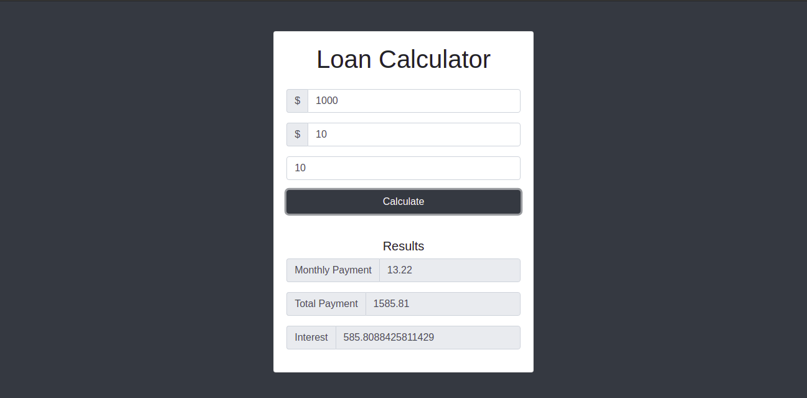

# Loan-Calculator

This is a personal project where the user can use this app to calculate a loan. This calculator accepts 3 fiels: `loan amount`, `interest amount`, `years to repay` and it returns `monthly payment`, `total payment` and `total interest`.

## Live server
<button> <a href="https://kind-heisenberg-382ade.netlify.app/"> Live demo!</a> </button>

## Built With 

- Javacript
- Bootstrap
- HTML
- CSS
- VS Code

## Install 

> In order to install this project please follow the next steps:

1. - [ ] Open the `Terminal`
2. - [ ] Navigate to the directory where you want to add this repository
3. - [ ] Run `git@github.com:GzimAsani/WeatherApp.git` or with HTTP`https://github.com/GzimAsani/WeatherApp.git` 
5. - [ ] Go to your browser and open `dist/index.html` in the cloned repo.

## Author

👤 **Gzim Asani**
- Github: [@GzimAsani](https://github.com/GzimAsani)
- Linkedin: [GzimAsani](https://www.linkedin.com/in/gzim-asani-83390a17a/)

## 🤝 Contributing

Contributions, issues and feature requests are welcome!

Feel free to check the [issues page](https://github.com/Div685/JS-Library/issues).

## Show your support

Give a ⭐️ if you like this project!